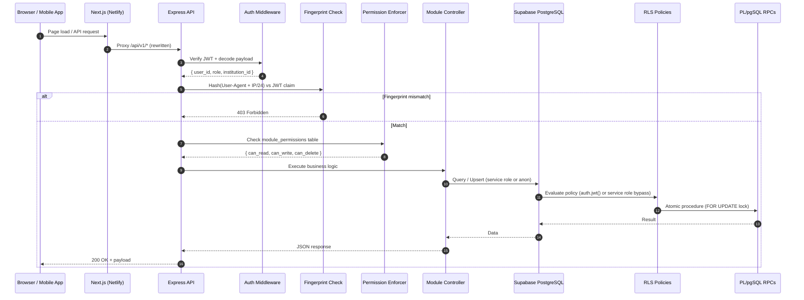
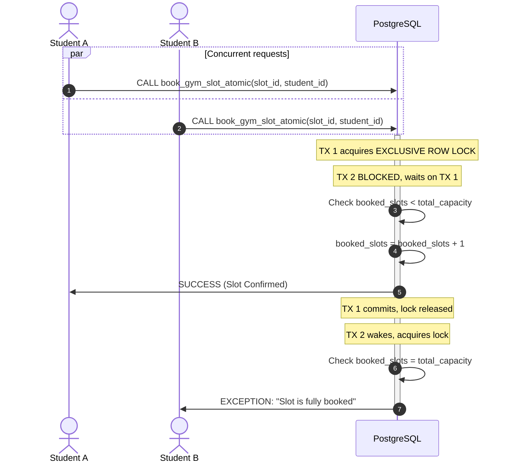

# IRIS 365 — AI-Powered Campus Operating System

A feature-complete, multi-tenant campus management platform — currently in active development toward production hardening for v1.0. Designed for Indian educational institutions, built for **SIN Education and Technology Pvt. Ltd. (Jodhpur, Rajasthan)**.

---

## Request Lifecycle



---

## Portals

| Role | Frontend Routes | Primary Functionalities |
| :--- | :--- | :--- |
| **SuperAdmin & Admin** | `src/app/admin` | Global config, user directory, feature toggles, analytics CRM |
| **Student** | `src/app/student` | ID Card, attendance, timetable, fee payment, gym slots |
| **Teacher** | `src/app/teacher` | Attendance marking, course schedules, OBE attainment |
| **Parent** | `src/app/parent` | Child attendance, term reports, parent-teacher scheduler |
| **Director** | `src/app/director` | P&L reports, campus goals, NAAC/NIRF indicators |
| **Hostel Warden** | `src/app/warden` | Room allocations, curfew rollcalls, complaints, visitors |
| **Librarian** | `src/app/librarian` | Book issue/return, stock index, fine collection |
| **Canteen Vendor** | `src/app/vendor/canteen` | Inventory, queue tickers, menu planner, wallet metrics |
| **Company Recruiter** | `src/app/company` | Placement drives, interviewer pools, applicant shortlisting |
| **Gate Security** | `src/app/gate` | RFID/QR entry, visitor passes, alerts, blacklist scanner |
| **Applicant** | `src/app/applicant` | Admission status, online application, fee gateway, uploads |

---

## Key Modules

| Module | Description | Tables | Roles | Route Prefix |
| :--- | :--- | :--- | :--- | :--- |
| **Students** | Enrollment, profiles, health scores, bulk import | `users`, `students`, `departments` | Admin, Staff, Teacher, Student | `/api/v1/core` |
| **Attendance** | QR/biometric/manual marking, rotating tokens, geo-fence | `attendance_sessions`, `attendance`, `qr_tokens`, `attendance_methods` | Admin, Teacher, Student | `/api/v1/core` |
| **Timetable** | Auto-generation, substitute assignment, clash detection | `timetables`, `timetable_blocks` | Admin, Teacher, Student | `/api/v1/core` |
| **Fees & Finance** | Structures, Razorpay payments, concessions, scholarships, installments | `fee_structures`, `fee_payments`, `concessions` | Admin, Student, Parent | `/api/v1/core` |
| **Exams & Results** | CIE/SEE marks, result publishing, marksheets | `exams`, `exam_results` | Admin, Teacher, Student | `/api/v1/core` |
| **Canteen** | Menu, orders, wallet, QR payments, inventory | `canteen_menu`, `canteen_orders`, `canteen_wallet` | Admin, Student, Vendor | `/api/v1/canteen` |
| **Hostel** | Blocks, rooms, complaints, visitors, fee tracking | `hostel_blocks`, `hostel_rooms`, `hostel_complaints`, `hostel_visitors` | Admin, Warden, Student | `/api/v1/hostel` |
| **Library** | Books, issues, returns, fines, study rooms, eBooks, search | `library_books`, `library_issues`, `library_fines` | Admin, Librarian, Student | `/api/v1/lib-events` |
| **FitZone Gym** | Equipment, trainers, slot booking, health metrics | `gym_equipment`, `gym_trainers`, `gym_bookings` | Admin, Student, Gym Trainer | `/api/v1/fitzone` |
| **Transit** | Routes, buses, live GPS tracking, stops | `transit_routes`, `transit_buses`, `transit_stops` | Admin, Driver, Student | `/api/v1/transit` |
| **Smart Gate** | Entry/exit logs, visitor passes, contractor permits, blacklist | `gate_entries`, `gate_visitors`, `gate_blacklist` | Admin, Security | `/api/v1/gate` |
| **Events** | Creation, registration, payments, check-in, analytics | `events`, `event_registrations` | Admin, Staff, Student | `/api/v1/events` |
| **Notices** | Multi-channel delivery (email/SMS/WhatsApp), read tracking | `notices`, `notice_reads` | Admin, Staff, Student | `/api/v1/core` |
| **ID Cards** | Template design, bulk generation, QR-verified digital cards | `idcard_templates` | Admin, Student | `/api/v1/core` |
| **HR Management** | Departments, payroll, leaves, appraisals, designations | `hr_departments`, `hr_payroll`, `hr_leaves` | Admin, HOD, Staff | `/api/v1/hr` |
| **OBE Maps** | Program outcomes, course outcomes, attainment, gap analysis | `obe_program_outcomes`, `obe_course_outcomes` | Admin, Teacher | `/api/v1/obe` |
| **NAAC Scorecard** | Criteria mapping, AQAR, evidence upload, scoring | `naac_criteria`, `naac_evidence` | Admin, IQAC | `/api/v1/naac` |
| **AI Concierge** | Chatbot, FAQ, escalations, WhatsApp integration | `ai_conversations`, `ai_query_logs` | All roles | `/api/v1/ai` |
| **Director Console** | Health scores, student journey, disengagement tracking | `student_health_scores`, `student_journeys` | Director, Admin | `/api/v1/director` |
| **Admissions** | Applications, merit lists, counseling slots, document verification | `admissions_applications`, `admissions_merit_lists` | Admin, Admissions Officer | `/api/v1/admissions` |
| **Placements** | Drives, companies, applications, offers | `placement_drives`, `placement_applications` | Admin, TPO, Student | `/api/v1/placements` |
| **Permissions** | Feature toggles, role-based module access, admin seeding | `institution_features`, `module_permissions` | Admin, SuperAdmin | `/api/v1/permissions` |

---

## Concurrency & Race-Condition Protections

Critical operations (library book borrow, gym slot booking, hostel allocation) execute through atomic PL/pgSQL procedures using `FOR UPDATE` row locking:



---

## Setup & Deployment

### Environment Variables

Create `.env` at project root:

```env
PORT=4000
NODE_ENV=production

# Supabase
SUPABASE_URL=https://your-project.supabase.co
SUPABASE_SERVICE_ROLE_KEY=your-service-role-key
SUPABASE_ANON_KEY=your-anon-key

# Auth
JWT_SECRET=your-jwt-secret-min-32-chars

# Frontend (Netlify)
NEXT_PUBLIC_SUPABASE_URL=https://your-project.supabase.co
NEXT_PUBLIC_SUPABASE_ANON_KEY=your-anon-key
NEXT_PUBLIC_API_URL=https://your-backend.onrender.com/api/v1
```

### Startup Validation

| Variable | Required | Behavior if Missing |
| :--- | :--- | :--- |
| `JWT_SECRET` | **Yes** | Server crashes on startup with `CRITICAL SECURITY VIOLATION` error |
| `SUPABASE_URL` | Yes | Console warning; server starts but all DB operations fail |
| `SUPABASE_SERVICE_ROLE_KEY` | Yes | Console warning; server starts but admin/service operations fail |
| `SUPABASE_ANON_KEY` | Yes | Console warning; anon client returns placeholder |
| `NEXT_PUBLIC_SUPABASE_URL` | Yes (frontend) | Frontend Supabase calls fail silently |
| `NEXT_PUBLIC_SUPABASE_ANON_KEY` | Yes (frontend) | Frontend Supabase calls fail silently |
| `NEXT_PUBLIC_API_URL` | Yes (frontend, Netlify) | API calls fail with "Connection failed" |
| `PORT` | No | Defaults to `4000` |
| `RAZORPAY_KEY_ID` / `KEY_SECRET` | No | Canteen/events/admissions payments fail at runtime |
| `ANTHROPIC_API_KEY` | No | AI Concierge and smart features fail at runtime |

### Database Initialization

1. Open `supabase_setup.sql` (or run migrations in `supabase/migrations/` in order)
2. Copy the SQL
3. Go to [Supabase Dashboard](https://supabase.com/dashboard) → SQL Editor → paste → Run

### Netlify Deployment

Set in Netlify environment variables:
- `NODE_VERSION` = `20`
- `NODE_ENV` = `production`
- `SUPABASE_SERVICE_ROLE_KEY` = your service role key (for Netlify Functions)
- `NEXT_PUBLIC_SUPABASE_URL`, `NEXT_PUBLIC_SUPABASE_ANON_KEY`

Build settings: command `npm run build`, publish `.next`, functions `netlify/functions`.

### Running Locally

```bash
npm install
npm run dev    # Starts Next.js (3000) + Express (4000) concurrently
```

---

## Test Credentials

All sandbox passwords: **`password123`**

| Email | Role | Notes |
| :--- | :--- | :--- |
| `siddharth@sin.education` | SuperAdmin | Full system access |
| `director@siet.edu.in` | Admin | Institution admin |
| `khushal@gmail.com` | Student | Mock sandbox student |
| `warden@siet.edu.in` | Warden | Hostel management |
| `security@siet.edu.in` | Security | Gate operations |
| `rajesh.driver@siet.edu.in` | Driver | Transit module |
| `alok.vyas@siet.edu.in` | Staff | Academic staff |
| `madanlal@gmail.com` | Parent | Parent portal |
| `canteen@siet.edu.in` | Vendor | Canteen operations |

> **Note**: These are sandbox bypass accounts that work even when the backend is unreachable. Full seed data (15 users across 10 roles) is in `supabase/seed.sql`.

---

## Mobile App

A React Native mobile app exists for student and parent portals.

- **Stack**: React Native + Expo SDK 51, TypeScript, Expo Router, NativeWind
- **Hardware APIs**: `expo-camera` (QR scanning), `expo-location` (geo-fencing), `expo-local-authentication` (biometrics)
- **Run**: `npx expo start` from the mobile directory
- **Spec**: See `mobile_screens_spec.md` (1916 lines) for full screen-by-screen specifications

---

## API Reference

Base URL: `https://your-backend.com/api/v1`

| Module | Prefix | Key Endpoints |
| :--- | :--- | :--- |
| Auth | `/auth` | `POST /login`, `GET /me` |
| Core (Students, Attendance, Timetable, Fees, Exams, Notices, ID Cards) | `/core` | `GET /students`, `POST /attendance/mark/qr`, `GET /timetable/:deptId`, `GET /fees/student/:id`, `GET /attendance/report/:deptId` |
| Canteen | `/canteen` | `GET /menu`, `POST /orders`, `POST /wallet/topup` |
| Hostel | `/hostel` | `GET /blocks`, `POST /complaints`, `POST /visitors/checkin` |
| Library | `/lib-events` | `GET /books`, `POST /issues/borrow`, `GET /fines` |
| FitZone | `/fitzone` | `GET /equipment`, `POST /bookings`, `POST /trainers` |
| Transit | `/transit` | `GET /routes`, `POST /buses`, `GET /live` |
| Gate | `/gate` | `POST /entries/scan`, `GET /visitors`, `POST /blacklist` |
| Events | `/events` | `GET /list`, `POST /register`, `POST /checkin` |
| HR | `/hr` | `GET /departments`, `POST /payroll/run`, `POST /leaves/approve` |
| OBE | `/obe` | `GET /programs`, `POST /outcomes`, `GET /attainment` |
| NAAC | `/naac` | `GET /criteria`, `POST /evidence`, `GET /scorecard` |
| AI | `/ai` | `POST /chat`, `GET /conversations`, `POST /escalate` |
| Director | `/director` | `GET /health-scores`, `POST /student-journey/intervention` |
| Admissions | `/admissions` | `POST /apply`, `GET /merit-list`, `POST /counseling/slots` |
| Placements | `/placements` | `POST /drives`, `GET /applications`, `POST /offers` |
| Permissions | `/permissions` | `GET /features/:id`, `POST /features`, `POST /seed` |

**Rate limiting**: `/auth/login` uses a stricter limiter. All other routes use standard rate limiting.

**Socket.io namespaces**: `/transit`, `/notifications`, `/gate`, `/canteen`, `/director`, `/events-live`

---

## Security

1. **JWT with device fingerprinting**: Session tokens include a SHA-256 hash of `User-Agent + IP/24` subnet. This provides defence-in-depth against casual token reuse but is not a substitute for short-lived tokens and refresh rotation.

2. **Row Level Security (RLS)**: All tables enforce multi-tenant isolation via `get_auth_institution_id()` and `get_auth_user_role()` functions reading from `auth.jwt()`. Service role bypasses RLS — this is used only in server-side cron jobs and admin seeding scripts. All user-facing API routes must use scoped JWT tokens. Using the service key in user-facing routes is a known risk that will be resolved in v1.1.

3. **API protection**: `helmet` header shielding, CORS whitelisting, request rate limiting on auth endpoints.

---

## Roadmap

| Version | Scope |
| :--- | :--- |
| **v0.9** (current) | Feature-complete prototype, sandbox auth bypass, mock data fallbacks |
| **v1.0** | Production auth (Supabase Auth migration), Razorpay webhook integration, FCM push notifications, rotating QR cron deployment |
| **v1.1** | Remove service role from all user-facing routes, implement refresh token rotation, add API key rotation for device integrations |

---

## License

Proprietary — SIN Education and Technology Pvt. Ltd. All rights reserved.
