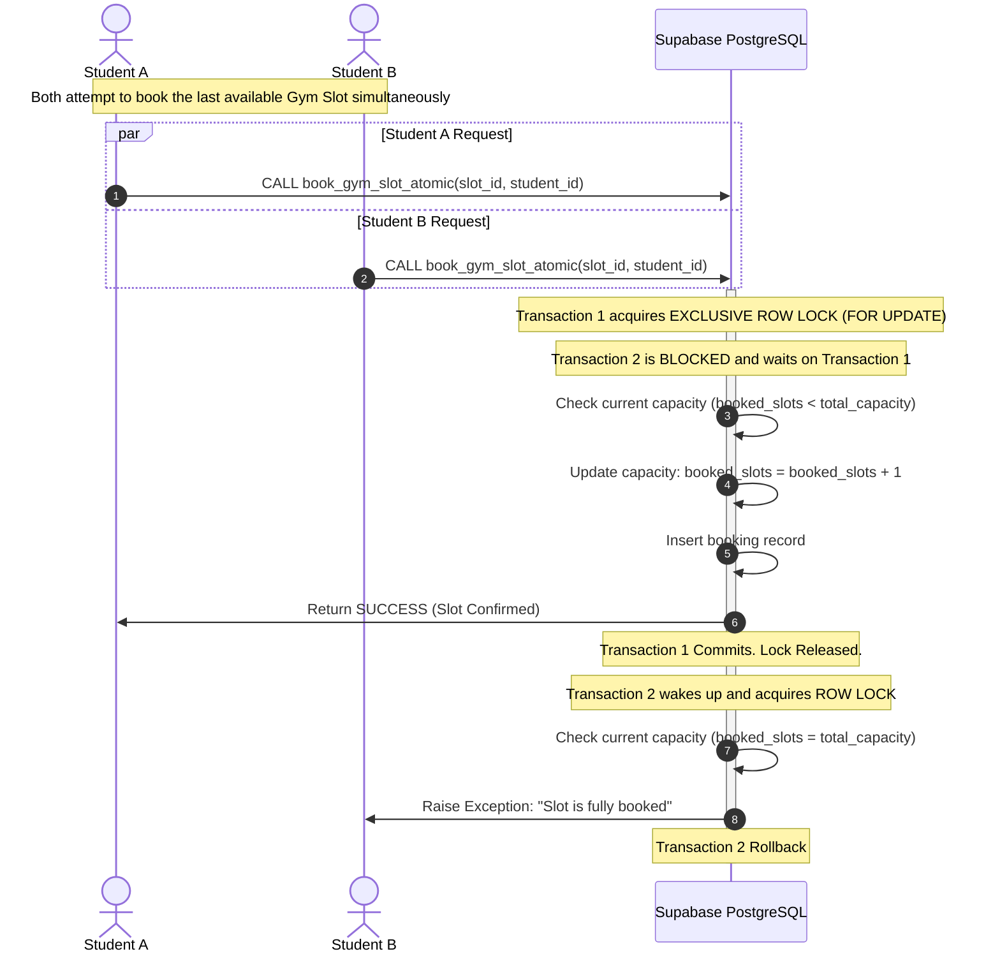

# IRIS 365 — AI-Powered Campus Operating System

IRIS 365 is a production-ready, multi-tenant campus management SaaS platform designed for Indian educational institutions. Built for **SIN Education and Technology Pvt. Ltd. (Jodhpur, Rajasthan)**, it integrates 11 comprehensive role-based portals under a unified, high-performance architecture.

---

## 🎨 System Architecture & Connectivity Flow

The following flowchart illustrates the request pipeline, real-time sync layer, and database protection layers of IRIS 365:

```mermaid
graph TD
    %% Clients
    classDef client fill:#1E1B4B,stroke:#818CF8,stroke-width:2px,color:#fff;
    classDef server fill:#111827,stroke:#10B981,stroke-width:2px,color:#fff;
    classDef database fill:#064E3B,stroke:#34D399,stroke-width:2px,color:#fff;
    classDef realTime fill:#7C2D12,stroke:#F97316,stroke-width:2px,color:#fff;

    subgraph UserPortals ["User Portals (Next.js 14 App Router)"]
        A["Admin Portal"]:::client
        B["Student Portal"]:::client
        C["Teacher Portal"]:::client
        D["Parent Portal"]:::client
        E["Warden Portal"]:::client
        F["Gate Portal"]:::client
        G["Librarian Portal"]:::client
        H["Canteen Vendor"]:::client
        I["Company Recruiter"]:::client
        J["Applicant Portal"]:::client
    end

    %% Network Routing
    Netlify["Netlify Edge (Frontend)"]:::server
    ExpressAPI["Express API Server (Port 4000)"]:::server
    SocketServer["Socket.io Server (Real-time Hub)"]:::realTime
    SupabaseDB[("Supabase (PostgreSQL Database)")]:::database

    %% Client Routing
    UserPortals -->|Static Assets / Page Loads| Netlify
    UserPortals -->|API Requests (/api/v1/*)| Netlify
    Netlify -->|Reverse Proxy Rewrite| ExpressAPI

    %% Express Server Middleware Pipeline
    subgraph ExpressPipeline ["Express Request Execution Pipeline"]
        AuthMid["Auth Middleware<br/>(JWT Decryption)"]:::server
        FingerprintMid["Device Fingerprint Verification<br/>(User-Agent + Subnet Hash)"]:::server
        PermissionMid["Permission Enforcer<br/>(Role-Based Access Control)"]:::server
        Controller["Express Module Controllers<br/>(Core Business Logic)"]:::server

        AuthMid --> FingerprintMid
        FingerprintMid --> PermissionMid
        PermissionMid --> Controller
    end

    ExpressAPI --> AuthMid

    %% Database Connections
    Controller -->|Admin Actions<br/>Service Role Key Bypass RLS| SupabaseDB
    UserPortals -->|Direct Scope Queries<br/>Anon Public Key + RLS| SupabaseDB

    %% Real-time connection
    UserPortals <-->|WebSocket Connection| SocketServer
    ExpressAPI <-->|Trigger Broadcasts| SocketServer

    %% Database Locking Mechanism
    subgraph DatabaseSafeguards ["Database Concurrency Control"]
        RLS["Row Level Security (RLS) Rules"]:::database
        RPC["Atomic PL/pgSQL Stored Procedures<br/>(FOR UPDATE Locks)"]:::database
        
        RLS --> RPC
    end
    SupabaseDB --- DatabaseSafeguards
```

---

## 🚀 Portals & Modules Breakdown

The project features a **unified single-root layout** where both frontend pages and backend endpoints share a single repository and dependency manager.

### 🏢 Portal Registry
| Role / Portal | Frontend Routes Directory | Primary Functionalities |
| :--- | :--- | :--- |
| **SuperAdmin & Admin** | [src/app/admin](file:///c:/Users/khushal/Desktop/new%20iris/src/app/admin) | Global configurations, global user directory, admissions cycles, analytics CRM. |
| **Student** | [src/app/student](file:///c:/Users/khushal/Desktop/new%20iris/src/app/student) | Digital ID Card verification, attendance logs, timetables, fee dues payment, FitZone slot booking. |
| **Teacher** | [src/app/teacher](file:///c:/Users/khushal/Desktop/new%20iris/src/app/teacher) | Direct attendance registry, course schedules, OBE (Outcome-Based Education) attainment. |
| **Parent** | [src/app/parent](file:///c:/Users/khushal/Desktop/new%20iris/src/app/parent) | Student attendance tracking, academic term reports, parent-teacher scheduler, fee billing logs. |
| **Director / Management** | [src/app/director](file:///c:/Users/khushal/Desktop/new%20iris/src/app/director) | Institutional P&L reports, campus goals roadmap, NAAC/NIRF indicators, operations summaries. |
| **Hostel Warden** | [src/app/warden](file:///c:/Users/khushal/Desktop/new%20iris/src/app/warden) | Room allocations, curfew rollcalls, student complaint loggers, visitor control boards. |
| **Librarian** | [src/app/librarian](file:///c:/Users/khushal/Desktop/new%20iris/src/app/librarian) | Stock index logs, book issue/return tracking, automatic fine collection triggers. |
| **Canteen Vendor** | [src/app/vendor/canteen](file:///c:/Users/khushal/Desktop/new%20iris/src/app/vendor/canteen) | Inventory stock manager, active queue tickers, menu planners, wallet transaction metrics. |
| **Company Recruiter** | [src/app/company](file:///c:/Users/khushal/Desktop/new%20iris/src/app/company) | Direct placement drive creator, schedule interviewer pools, shortlist applicants. |
| **Campus Gate Security** | [src/app/gate](file:///c:/Users/khushal/Desktop/new%20iris/src/app/gate) | RFID/QR entry loggers, visitor pass creator, security alerts & blacklist scanner. |
| **Applicant / Candidate** | [src/app/applicant](file:///c:/Users/khushal/Desktop/new%20iris/src/app/applicant) | Admissions status checklist, online application, fee gateway sandbox, document upload tool. |

---

## ⚙️ Concurrency & Race-Condition Protections

To handle highly concurrent actions (such as library book borrow, gym slot booking, and hostel bed allocations), IRIS 365 executes critical operations through atomic database procedures written in PL/pgSQL. 

The diagram below details the locking pattern used in [book_gym_slot_atomic](file:///c:/Users/khushal/Desktop/new%20iris/supabase_setup.sql):



---

## ⚙️ Setup & Deployment

### 1. Environment Configurations
Create a `.env` file at your root directory (`/new iris/.env`) modeled after [.env.example](file:///c:/Users/khushal/Desktop/new%20iris/.env.example):

```env
PORT=4000
NODE_ENV=production

# Supabase Configurations
SUPABASE_URL=https://your-project.supabase.co
SUPABASE_SERVICE_ROLE_KEY=your-administrative-service-role-key
JWT_SECRET=your-jwt-signing-secret-key-min-32-chars

# Client/Frontend Configurations
NEXT_PUBLIC_SUPABASE_URL=https://your-project.supabase.co
NEXT_PUBLIC_SUPABASE_ANON_KEY=your-anonymous-public-key
NEXT_PUBLIC_API_URL=https://your-express-backend.com/api/v1
```

> [!WARNING]
> The Express backend requires `SUPABASE_SERVICE_ROLE_KEY` to run user synchronization tasks, execute database migrations, and handle cashless payment verifications. Keep this key hidden and never expose it to client-side scripts.

---

### 2. Database Initialization
A unified script is provided to spin up your database instance in a single step:
1. Open the [supabase_setup.sql](file:///c:/Users/khushal/Desktop/new%20iris/supabase_setup.sql) file.
2. Copy its entire content.
3. Open your project on the [Supabase Dashboard](https://supabase.com/dashboard).
4. Go to **SQL Editor** -> **New Query**, paste the script, and press **Run**.

---

### 3. Netlify Deployment Environment

This project is optimized for deployment on Netlify. When deploying to Netlify, configure the build settings as follows:

1. **Build Command**: `npm run build`
2. **Publish Directory**: `.next`
3. **Environment Variables**:
   * Set `NODE_VERSION` to `20` (or `22`).
   * Set `NODE_ENV` to `production`.

> [!IMPORTANT]
> **Why `NODE_ENV=production` is required**: If Netlify runs the build command with `NODE_ENV` set to `development` in the environment variables, Next.js tries to compile the application under development/diagnostic modes. This causes pre-render steps for error fallback pages (`/404` and `/500`) to crash with a `Html should not be imported outside of pages/_document` error. Ensuring `NODE_ENV=production` is enforced under `[build.environment]` inside [netlify.toml](file:///c:/Users/khushal/Desktop/new%20iris/netlify.toml) prevents this compiler crash.

---

### 4. Running Locally
To launch both the Next.js development server (Port 3000) and the Express API server (Port 4000) concurrently:

```bash
# Install packages
npm install

# Run frontend & backend dev servers concurrently
npm run dev
```

---

## 🔒 Advanced Security Implementations

1. **Session Hijacking Guard (Device Fingerprinting)**: 
   At session creation, the backend signs a SHA-256 device signature inside the user's JWT based on the browser's user-agent and IP network subnet. If a token is stolen and replayed from a different client configuration, the request fails with `403 Forbidden`.
   
2. **Hardened Multi-Tenant Row Level Security**: 
   Database tables are enforced with strict multi-tenant tenant isolates. For example, hostel wardens can only access records scoped to blocks where they are assigned (`auth.uid() = hb.warden_id`), and students are locked to reading only their own records.

3. **API Protection Layers**:
   Enforced with `helmet` header shielding, strict `cors` white-listing, and request rate limiting to defend against brute force vectors on auth-endpoints.
